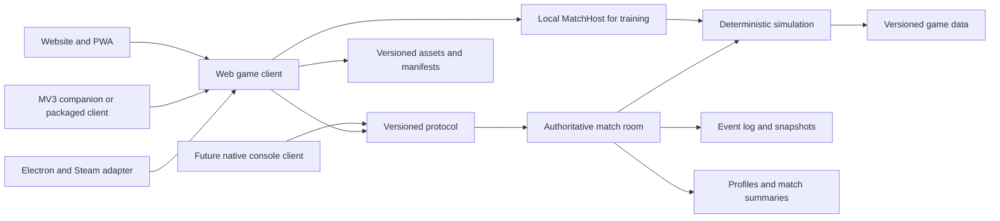

# Dungeon Barrage Platform Strategy

**Status:** Architecture decision record and implementation baseline  
**Primary decision:** Ship the website/PWA first; treat Chrome, Steam, and console as adapters around a stable game and protocol  
**Related product rules:** [PRODUCT_SPEC.md](./PRODUCT_SPEC.md)

> ## ⚠️ LARGELY SUPERSEDED — read this first
>
> [ADR 0004](./adr/0004-native-desktop-rust-csharp.md) reversed the web-first decision on
> 2026-08-06. The canonical surface is now a **native desktop C# client** calling the Rust
> core over a C ABI. Web delivery is dropped.
>
> | Section | Status |
> |---|---|
> | §1 Executive decision (web-first) | **Reversed** |
> | §3 Why the website/PWA is canonical | **Reversed** |
> | §9 Website and PWA plan | **Deleted** |
> | §10 Chrome Manifest V3 path | **Dead** — presupposed a web client to companion |
> | §11 Steam path | **Promoted** from post-MVP option to primary distribution |
> | §12 Console path | Now materially closer; a native client ports far more plausibly |
> | §13 Hosting roadmap | **Obsolete** — Cloudflare/D1/Vinext all removed |
> | §6 Simulation architecture | **Still current**, and now implemented in Rust |
> | §8 Platform service contract | **Still current** — the adapter boundary was the point |
> | §14 Security and privacy | **Still current** — see `SECURITY_BASELINE.md` |
> | §15 Build/test/release gates | **Still current**, minus the browser matrix |
> | §17 What not to overbuild | **Still current** and still good advice |
>
> Retained unedited below as the record of what was decided and why, because the reasoning
> in §6, §8, §14, and §15 outlived the platform choice it was written for.


## 1. Executive decision

Dungeon Barrage is web-first.

- The canonical client is a desktop website with an installable PWA manifest.
- The production gameplay layer is a two-dimensional, fixed-step simulation rendered through Phaser/WebGL inside the existing React/Vinext site shell.
- Online matches use an authoritative room service over WebSockets.
- A Chrome Manifest V3 extension is optional and should begin as a narrow companion, not a second canonical game client.
- A Steam edition may wrap the locally packaged web client in Electron and connect to the same backend.
- A console edition should be treated as a client port using shared protocol and content contracts, not as a promise that browser code will run unchanged.

This decision assumes Steam and console are future options. If a funded requirement changes to “ship website and consoles together,” stop before production content work and reevaluate Phaser against a console-supported engine such as Unity or Godot.

## 2. Current repository state

At the time of this decision, the repository is a clean Sites starter:

- React 19, TypeScript, Vinext, and Vite.
- Cloudflare Worker entry point for the web application.
- `.openai/hosting.json` declares neither D1 nor R2.
- The application route still renders the starter preview.
- The Drizzle schema is intentionally empty.
- No game engine, match server, account database, or production content exists yet.

The architecture in this document is the target. Do not describe unimplemented systems as complete, and do not add persistence or distribution wrappers merely to make the tree resemble the target.

## 3. Why the website/PWA is canonical

| Concern | Website/PWA | MV3 extension | Electron/Steam | Console |
|---|---|---|---|---|
| Fast iteration | Best | Store review slows updates | Build review and packaging | Certification and platform access |
| Link sharing and onboarding | Best | Installation required | Store installation | Store installation |
| WebGL/Phaser fit | Native | Good if all code is packaged | Good through bundled Chromium | Requires validation or a port |
| Accounts and multiplayer | Direct HTTPS/WSS | Extra extension auth/storage concerns | Platform identity adapter | Platform identity adapter |
| Distribution value today | High | Low until companion features exist | Medium after retention is proven | Low until funded |
| Recommended timing | Now | After MVP evidence | After MVP evidence | After funding and platform approval |

The PWA supplies installability, a home-screen/desktop entry point, full-window play, asset caching, and web updates without the permission and review surface of an extension.

## 4. Target architecture



### Runtime responsibilities

| Runtime | Owns | Must not own |
|---|---|---|
| React/Vinext shell | Routes, lobby, settings, customization, account UI, accessibility shell | Hit detection or authoritative match state |
| Phaser client | Terrain rendering, sprites, particles, camera, input presentation, timeline playback | Confirmed damage, ammo, timer, terrain, or rewards |
| Local MatchHost | Authoritative training and bot match using the shared simulation API | Separate tutorial-only game rules |
| Match room | Validation, turn state, simulation, reconnect snapshot, event log | Long-term cosmetic storefront presentation |
| HTTP/profile API | Identity linkage, saved loadouts, entitlements, match summaries | Active per-tick match simulation |
| Database | Durable account, inventory, entitlement, and summary state | Render ticks or transient particles |
| Object storage/CDN | Atlases, maps, audio, immutable content packages | Executable extension code delivered outside extension review |

## 5. Source boundaries

Do not reorganize the starter into an empty monorepo before the firing-loop spike. Introduce code only as the corresponding capability is built.

Recommended initial layout:

```text
app/                         Existing site shell and routes
game/
  client/                    Phaser bootstrap, scenes, rendering adapters
  simulation/                Pure deterministic match rules
  protocol/                  Commands, events, codecs, validation
  content/                   Versioned weapon, map, and mode definitions
  avatar/                    Layer manifests, sockets, cosmetic assembly
  replay/                    Command log, hashes, timeline playback
  platform/                  PlatformServices interfaces and web adapter
services/
  match-server/              Added at the online-slice milestone
targets/
  extension/                 Added only after the extension decision gate
  desktop/                   Added only after the Steam decision gate
```

When `services/match-server` needs shared modules, promote `simulation`, `protocol`, and `content` into npm workspaces rather than copying them. The expected production shape is then:

```text
apps/web
apps/game-server
apps/extension               optional
apps/desktop                 optional
packages/simulation
packages/protocol
packages/game-data
packages/avatar-manifest
packages/replay
packages/platform-contracts
```

### Dependency rules

- `simulation` imports no DOM, Canvas, Phaser, React, Node, database, network, or platform SDK modules.
- `protocol` imports only schemas, codecs, and shared scalar types.
- `game-data` contains validated data and behavior identifiers, not arbitrary code strings.
- `client` may import simulation for local training and prediction but cannot mutate authoritative online state.
- `game-server` imports simulation, protocol, and game-data.
- Platform targets implement `platform-contracts`; game rules never import Electron, Chrome, Steamworks, or console SDKs.
- Avatar and weapon-skin manifests do not import or override gameplay definitions.

## 6. Simulation architecture

### Core approach

- Use a fixed simulation step of 30 or 60 Hz; rendering remains independent.
- Quantize angle, power, position, velocity, wind, and timed inputs at the protocol boundary.
- Use a seeded pseudo-random generator whose algorithm and version are recorded with the match.
- Represent terrain occupancy in typed arrays at a lower resolution than the display texture.
- Record ordered terrain operations and periodic compressed snapshots.
- Calculate damage, knockback, terrain destruction, and status effects separately.
- Keep character locomotion kinematic and restrained for the MVP.

The custom simulation owns projectile integration, terrain queries, explosion overlap, damage, knockback, hazards, and settling criteria. Phaser or a general physics library may support cosmetic debris and client-only effects. Third-party rigid-body results are not accepted as authoritative unless cross-runtime determinism is proven.

### MatchHost interface

Both training and online rooms use the same host contract:

```ts
interface MatchHost {
  getSnapshot(): MatchSnapshot;
  submit(command: MatchCommand): Promise<CommandReceipt>;
  subscribe(listener: (event: MatchEvent) => void): () => void;
  close(): Promise<void>;
}
```

- `LocalMatchHost` calls the simulation in-process for training and bots.
- `RemoteMatchHost` sends commands over WebSocket and plays authoritative events.
- UI and Phaser scenes depend on `MatchHost`, never directly on Colyseus or a local simulator.

### Terrain replication

```ts
interface TerrainOperation {
  sequence: number;
  type: "subtractCircle" | "subtractCapsule" | "subtractPolygon";
  geometry: Record<string, number | number[]>;
  materialMask: Array<"soil" | "wood" | "reinforcedStone">;
}
```

Clients apply operations in strict sequence. A reconnect snapshot contains the base map/version, latest terrain mask snapshot, and later operations. A missing sequence triggers recovery rather than best-effort application.

### Content versioning

Every match records:

- `simulationVersion`
- `protocolVersion`
- `contentVersion`
- `mapDefinitionVersion`
- Exact weapon-definition versions for each submitted loadout
- Random seed and PRNG version

Do not mutate a definition used by completed matches. Publish a new version. Balance-only changes may arrive as validated data; a new behavior identifier requires a client/server build.

## 7. Authoritative networking

### Baseline

- WebSockets are the required transport.
- Node.js with Colyseus is the baseline match-room service because room ownership, reconnection, and schema synchronization align with the game model.
- One match is owned by one process.
- The server can simulate a committed attack faster than real time and send a timestamped result timeline for clients to animate.
- Use snapshots for recovery, not as per-frame terrain replication.
- Do not use peer hosting, WebRTC authority, rollback, or multi-worker physics for the MVP.

### Command envelope

```ts
interface FireCommand {
  commandId: string;
  matchId: string;
  expectedStateVersion: number;
  expectedTurnId: string;
  playerId: string;
  equippedWeaponId: string;
  weaponDefinitionVersion: number;
  angleMilliDegrees: number;
  powerBasisPoints: number;
  clientSentAt: number;
}
```

The server validates session, membership, phase, turn ownership, deadline, state version, equipped slot, definition version, ammunition, input ranges, movement completion, status restrictions, and command-ID uniqueness.

### Result envelope

```ts
interface ActionResolvedEvent {
  actionId: string;
  stateVersionBefore: number;
  stateVersionAfter: number;
  simulationVersion: number;
  seed: number;
  sampledPath: Array<{ tMs: number; x: number; y: number }>;
  impacts: ImpactEvent[];
  terrainOps: TerrainOperation[];
  damageEvents: DamageEvent[];
  statusChanges: StatusChange[];
  eliminatedPlayerIds: string[];
  finalStateHash: string;
}
```

### Idempotency and ordering

- `commandId` is unique within a match and retained long enough to reject retries.
- Every mutation includes state-before/state-after versions.
- Late or reordered commands are rejected, not applied to a newer turn.
- Ammunition, damage, Backlash, terrain, XP, and currency use idempotent mutation paths.
- Clients acknowledge applied event sequence numbers.

### Reconnection

A reconnect payload includes:

- Match, simulation, protocol, and content versions.
- Current phase, turn ID, state version, server-clock offset, and deadline.
- Base map and seed.
- Latest terrain snapshot plus later operations.
- Players, health, ammunition, loadouts, statuses, and positions.
- Any active resolution timeline.
- Recent event summaries and expected state hash.

The room completes an already committed action. It grants a 45-90 second grace period, then applies a deterministic timeout or concession rule.

## 8. Platform service contract

Game UI accesses platform features through one adapter:

```ts
interface PlatformServices {
  kind: "web" | "extension" | "steam" | "console";
  auth: AuthProvider;
  storage: StorageProvider;
  lifecycle: LifecycleProvider;
  notifications?: NotificationProvider;
  achievements?: AchievementProvider;
  commerce?: CommerceProvider;
  social?: SocialProvider;
  capabilities: PlatformCapabilities;
}
```

### Required separation

- Internal `playerId` is not a Steam ID, browser identity header, email address, or console account ID.
- External identities map to the internal player ID through provider records.
- Entitlements are server-owned and derived from verified platform receipts.
- Save data distinguishes device settings from account progression.
- Input maps physical inputs to semantic actions such as `moveLeft`, `aimUp`, `charge`, `commit`, `cancel`, and `focusCharacter`.
- Screens never assume mouse hover, right-click, or a physical keyboard is available.

## 9. Website and PWA plan

### Web application composition

- Keep Vinext/React for the public page, lobby, room flow, customization, settings, and account surfaces.
- Mount Phaser only in a client-side `/play` experience.
- Keep text-heavy, focusable UI in HTML/CSS where practical.
- Overlay critical DOM/ARIA status for canvas-only state.
- Load match-critical content before optional cosmetics.

### PWA requirements

- A product-specific web app manifest with name, short name, icons, theme color, display mode, and canonical start URL.
- A versioned service worker that caches the shell and immutable hashed assets.
- Network-first handling for mutable APIs and match connectivity.
- No service-worker caching of authentication callbacks or private API responses.
- Offline support is limited to the training range and previously cached content.
- Multiplayer always presents explicit offline/reconnect state.
- Updates activate between matches, not during an active match.

### Identity in the current starter

The Sites starter can expose ChatGPT/workspace identity headers, but these are not the final cross-platform game identity. If used for a private preview, wrap them in `AuthProvider`. Do not embed header names or site-scoped IDs in simulation, protocol, loadouts, or match history.

Public vertical-slice play should begin with a generated guest identity. Account conversion is an MVP capability after retention is demonstrated.

### Current storage bindings

- Keep D1 `null` during the local firing-loop spike unless saved shared state is genuinely required.
- Keep R2 `null` while initial assets fit comfortably in `public/`.
- Add storage deliberately at the milestone that needs it; do not add empty schemas or buckets for future-proofing.

## 10. Chrome Manifest V3 path

### Recommended product

Do not create a link-only extension. If web retention justifies Chrome distribution, the first extension should have one narrow purpose: **the Dungeon Barrage companion for quick launch, invites, and turn-ready alerts**.

Potential companion surface:

- Action popup showing signed-in state and active invitation.
- “Play” action that focuses an existing game tab or opens the canonical URL.
- Notifications for accepted invites or turn-ready events when appropriate.
- Small local preferences such as notification opt-in.

The companion does not inject content into arbitrary pages, replace search/new-tab behavior, inspect browsing history, or request broad tab access.

### MV3 implementation constraints

- Bundle all executable JavaScript and WebAssembly in the extension package.
- Remote HTTPS/WSS endpoints may provide authenticated APIs, match events, JSON balance data, and assets, but not code to execute.
- Treat the background service worker as event-driven and disposable; do not rely on an immortal connection.
- Request only permissions needed by the shipped version. Likely initial permissions are `storage` and `notifications`, with exact backend origins only if cross-origin access requires them.
- Use a restrictive extension CSP and add `wasm-unsafe-eval` only if packaged WASM is actually introduced.
- Store the least possible credential material and prefer short-lived tokens.
- Keep companion and full-client build artifacts separate.

### Optional packaged extension client

A full `chrome-extension://` game client is a later option, not the default. If built:

- Compile the same reviewed client source into an extension-specific static target.
- Package all game code locally.
- Load balance and cosmetic data only through validated manifests.
- Connect to the same authoritative WSS backend.
- Keep the action popup as a launcher; play in a full extension tab, not the popup.
- Measure package size, cold start, WebGL behavior, audio activation, and extension-update cadence before store submission.

### Decision gate

Build the extension only if at least one is true:

- A meaningful portion of retained web players requests browser-resident alerts.
- Invites/turn alerts measurably improve return rate.
- The Chrome Web Store supplies discoverability unavailable to the PWA.

Otherwise, keep the PWA as the installation path.

## 11. Steam path

### Packaging recommendation

Use Electron as the first Steam wrapper because a bundled Chromium version gives Phaser/WebGL behavior closer to the canonical web client than varying system webviews.

- Package the built client and match-critical assets locally.
- Do not ship a shell that merely navigates to the live website.
- Keep remote multiplayer, profile, and content APIs behind HTTPS/WSS.
- Use Steam's normal build/update channel for executable client changes.

### Security boundary

- `nodeIntegration: false`
- `contextIsolation: true`
- Renderer sandbox enabled where compatible.
- A narrow preload bridge with typed, allowlisted methods.
- No generic filesystem, shell, or arbitrary IPC access from the game renderer.
- Validate all data crossing the bridge.

### Steam adapter responsibilities

- Steam identity assertion translated to internal player identity server-side.
- Achievements and stats.
- Steam Cloud for appropriate device/account saves.
- Overlay-compatible display modes.
- Gamepad and Steam Deck input glyphs.
- Optional purchases through a verified entitlement flow.
- Suspend, focus, and connectivity lifecycle events.

Steam features remain optional capabilities. The web client must not render a broken button when an adapter is absent.

### Steam release gate

- Web MVP demonstrates retention and match stability.
- Controller-only navigation completes customization, lobby, match, and results.
- The Electron build meets memory, load-time, and GPU budgets on target hardware.
- Steam content survey, AI-content disclosure, ratings, store assets, and build review are ready.

## 12. Console path

### Portability promise

The portable assets are:

- Game rules and behavior specification.
- Versioned protocol.
- Versioned content definitions.
- Authoritative server and replay/event semantics.
- Validated sprite atlases, audio, and art source files.
- Golden command logs and expected state hashes.
- Semantic input and platform-service contracts.

The likely non-portable assets are the browser shell, DOM UI, Phaser renderer integration, MV3 code, Electron bridge, and Steam-specific services.

### Expected console implementation

- A supported native engine implements presentation, input, lifecycle, storage, commerce, achievements, and networking.
- Online play connects to the same authoritative backend through the versioned protocol.
- Local training either uses a native implementation validated against golden replays or a future shared native/WASM core.
- The UI supports safe areas, controller focus, platform glyphs, suspend/resume, user sign-out, network loss, and storage failure.
- Platform SDK details remain isolated behind `PlatformServices` and may be subject to NDA.

### Rust/WASM decision

Do not rewrite the simulation in Rust for hypothetical portability. Consider a Rust core compiled to WebAssembly and native targets only when:

- Console work is funded and platform access is confirmed;
- Profiling shows TypeScript simulation limits; or
- Maintaining two simulation implementations becomes a demonstrated risk.

Golden replay fixtures remain required even with a shared binary.

## 13. Hosting and scale roadmap

### Phase A: firing-loop spike

- Current Sites/Vinext build hosts the shell and local client.
- Training uses `LocalMatchHost`.
- Assets live with the web build.
- No database, Redis, multi-region service, or account system.

### Phase B: online vertical slice

- One Node.js/Colyseus game-server process in one region.
- Private room codes only.
- Guest sessions and short-lived room tokens.
- In-memory active matches plus structured event logging.
- No Redis while one process owns all rooms.
- No durable economy.

### Phase C: MVP

- Static web application and immutable assets behind a CDN.
- One or more authoritative game-server processes.
- Managed PostgreSQL for accounts, external identities, entitlements, saved loadouts, progression, and match summaries.
- Object storage for larger versioned asset packages and replay snapshots if needed.
- Automated backups and restore rehearsal.
- Redis presence/routing only when a second room process is introduced.

The optional D1 path remains suitable for modest site-owned records, but do not split critical identity/economy state across D1 and PostgreSQL without a clear ownership reason.

### Scale triggers

Add processes or regions after representative load shows sustained pressure such as:

- CPU above roughly 65-70%.
- Event-loop delay above 20 ms.
- Pre-network command processing p95 above 50 ms.
- Memory above roughly 70% of its limit.
- Garbage-collection pauses delaying phases.
- Join or reconnect failures during burst tests.

Each match remains on one room process. Do not distribute one match's physics across workers.

## 14. Security and privacy

### Trust boundary

- Never accept client-reported hits, damage, ammunition, terrain state, XP, currency, ownership, or purchases.
- Validate message shape, size, rate, membership, version, phase, and value ranges.
- Use TLS for all HTTP and WebSocket traffic.
- Use short-lived, audience-scoped match tokens.
- Separate administrative events from player chat and gameplay events.
- Reconstruct replays from authoritative commands/events, not client video.

### Minimal data collection

- Collect only identity, operational, moderation, progression, and gameplay telemetry needed for the stated product purpose.
- Keep email and provider identifiers out of match payloads and replays.
- Give guest players a clear path to play before account creation.
- Publish privacy and retention disclosures before public account or extension launch.
- Do not collect browsing history or unrelated page data through the extension.

## 15. Build, test, and release gates

### Required automated suites

| Suite | Evidence |
|---|---|
| Simulation unit tests | Ballistics, damage, knockback, Backlash, terrain, ammo, and turn transitions |
| Determinism/golden tests | Same version, seed, and commands produce the same events and final hash |
| Property tests | No invalid health/ammo values, duplicate rewards, or out-of-bounds terrain operations |
| Protocol tests | Reject malformed, duplicate, late, reordered, cross-player, and version-mismatched commands |
| Content validation | Unique IDs, valid slot, known behavior, bounded numbers, complete skin compatibility |
| Asset validation | Frame tags, pivots, sockets, atlas bounds, dimensions, compression, and budgets |
| Browser integration | Complete matches in supported Chrome, Edge, Firefox, and Safari families |
| Reconnect tests | Recovery during planning and resolution reconstructs the same state |
| Load tests | Planning-heavy rooms, synchronized impacts, reconnect storms, and summary writes |

### Release compatibility

- Server advertises supported protocol and client-build ranges.
- A client outside the supported range receives a clear update requirement before matchmaking.
- Active matches pin simulation/content versions until completion.
- Deployments drain active rooms rather than terminating them where practical.
- A content rollback does not reinterpret completed replays.

### Performance budgets

| Area | Target | Fallback ceiling |
|---|---:|---:|
| Rendering | 60 fps | Stable 30 fps |
| Main-thread long tasks during aim | None above 50 ms | Rare; never repeated |
| Initial code, compressed | Under 3 MB | Under 5 MB |
| Initial playable content, compressed | Under 15 MB | Under 25 MB |
| Warm start | Under 2 seconds | Under 4 seconds |
| Normal crater update | Under 4 ms | Under 16.7 ms |
| Same-region command acknowledgement p95 | Under 150 ms | Investigate above target |
| Standard server shot computation | Under 50 ms | Profile before scaling |

## 16. Observability

Record structured, privacy-minimized events for:

- Match creation, join, leave, completion, and concession.
- Turn duration and timeout.
- Command accepted/rejected with categorized reason.
- Simulation duration and terrain-operation size.
- Reconnect attempt and result.
- State-hash mismatch.
- Weapon selection, damage, terrain change, displacement, Backlash, and elimination cause.
- Client load time, frame-time tier, crash boundary, and network quality tier.

Alerts should focus on match failure, repeated hash mismatch, elevated rejected-command anomalies, reconnect failures, service saturation, and durable-write failure.

## 17. What not to overbuild

Before the web MVP proves retention, do not build:

- Extension and Electron targets in parallel with the game.
- Console SDK integrations.
- Microservices for each domain.
- Redis in a single-process deployment.
- Multi-region room migration.
- Rollback networking or peer authority.
- A generic ECS solely for future flexibility.
- A remote weapon scripting system.
- Full 3D destructible terrain.
- Cross-platform commerce and entitlement reconciliation.
- User-uploaded art or community markets.
- Large account, guild, seasonal, or ranked systems.

The first architecture question is whether the firing loop is fun and deterministic. The first distribution question is whether players return to the web version.

## 18. Decision gates

| Gate | Required evidence | Decision unlocked |
|---|---|---|
| Firing loop | Repeated voluntary local play; stable deterministic tests | Build six-weapon vertical slice |
| Remote play | Private matches and reconnect pass; command security holds | Build 2-4 player MVP |
| Content scalability | New weapons/skins ship through validated definitions/manifests | Expand catalog and progression |
| Retention | Completion, rematch, and return metrics meet product targets | Public matchmaking and distribution experiments |
| Chrome value | Alerts/invites have demonstrated value beyond PWA install | MV3 companion |
| Steam value | Controller flow and retained audience justify packaging | Electron/Steam adapter |
| Console viability | Funding, platform access, audience case, and port estimate | Native console client plan |

## 19. Policy, IP, and ratings notes

These are risk controls, not legal advice.

- Chrome Manifest V3 requires extension executable code to be packaged rather than remotely hosted. See [Manifest V3](https://developer.chrome.com/docs/extensions/develop/migrate/what-is-mv3) and [remote-hosted code guidance](https://developer.chrome.com/docs/extensions/develop/migrate/remote-hosted-code).
- Chrome Web Store policy expects a narrow single purpose and minimum required permissions. See [quality/policy troubleshooting](https://developer.chrome.com/docs/webstore/troubleshooting/) and [user-data guidance](https://developer.chrome.com/docs/webstore/program-policies/user-data-faq).
- FN Herstal lists FIVE-SEVEN and FN FIVE-SEVEN among its trademarks. Use the generic “5.7 Service Pistol” description and an original fictional silhouette instead. See [FN Herstal intellectual property](https://fnherstal.com/en/intellectual-property/).
- Copyright does not protect an underlying idea or system, but it does protect original expression. Use “layered paper-doll customization” and original art/UI rather than copying reference games. See [U.S. Copyright Office Circular 31](https://www.copyright.gov/circs/circ31.pdf).
- A brand name can identify the source of goods/services and should receive clearance in the relevant markets. See [USPTO trademark basics](https://www.uspto.gov/trademarks/basics/what-trademark) and the [Canadian Trademarks Database](https://ised-isde.canada.ca/cipo/trademark-search/srch?lang=eng).
- Stylized fantasy/cartoon violence may still receive age and content descriptors. Presentation, blood, injury detail, online interaction, and purchases matter. See the [ESRB ratings guide](https://www.esrb.org/ratings-guide/).
- Steam requires a content survey before store/build review, including relevant mature-content and shipped generative-AI disclosure. See the [Steamworks content survey](https://partner.steamgames.com/doc/gettingstarted/contentsurvey?language=english).
